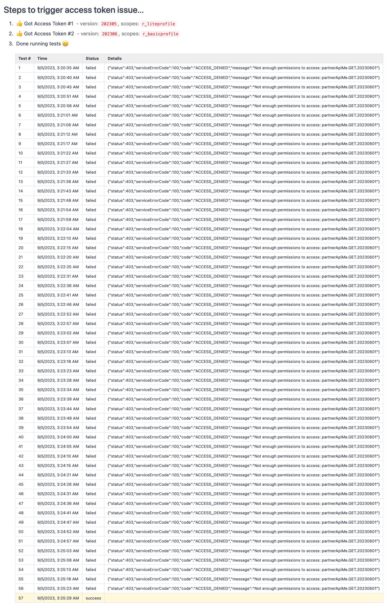

# LinkedIn API Auth Problem

After creating a new access token, the old token can still be used -- for up to
5 minutes (after the last call made with the old token).

This makes development difficult. Any time we make a change to the permission
scopes, new tokens may still use the old permission (from a previous token) for
several minutes, making it seem like the change didn't make any difference.

This also creates a problem when migrating from LinkedIn-Version: 202305 to
version 202306. LinkedIn-Version 202306 changed the minimum permission required
for the `/rest/me` endpoint -- from `r_liteprofile` to `r_basicprofile`. When we
have the user reauthorize their LinkedIn account, to get a new access token
(with `r_basicprofile` scope), they could get permission errors from an old
token (with `r_liteprofile`) if it was used in the past 5 minutes.

## Setup

Create a `.env` file with the following:

```bash
# .env
LINKEDIN_API_KEY=...
LINKEDIN_API_SECRET=...
ROOT_URL=http://localhost:3000
```

Start the server:

```bash
yarn install
yarn start
```

## Sample Output

Notice how it takes about 5 minutes before the new token starts working...


