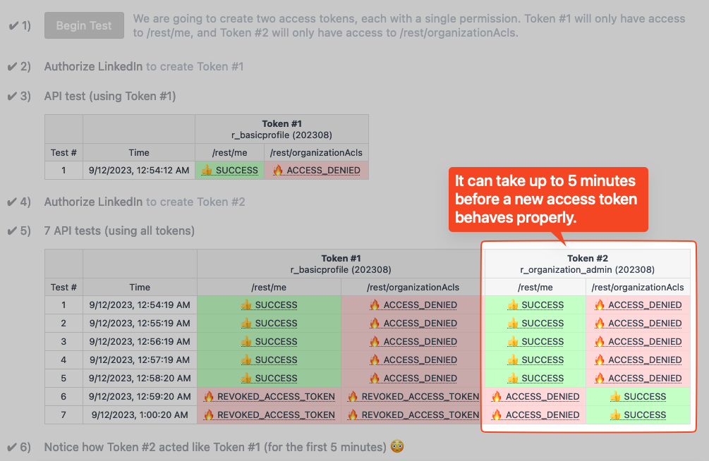

# LinkedIn API Auth Problem

## TL;DR
It can take up to 5 minutes before a new access token works correctly.

## Explanation

When you create a new LinkedIn access token, with new permissions (a.k.a.
scopes), the old access token should be invalidated, as per this note from the
[API docs](https://learn.microsoft.com/en-us/linkedin/shared/authentication/authorization-code-flow?tabs=HTTPS1#response)

> **Access Token Scopes and Lifetime**
>
> Access tokens stay valid until the number of seconds indicated in the
> expires_in field in the API response. You can go through the OAuth flow on
> multiple clients (browsers or devices) and simultaneously hold multiple valid
> access tokens if the same scope is requested. **If you request a different
> scope than the previously granted scope, all the previous access tokens are
> invalidated.**

However, if the old access token was recently used to make an API call -- less
than 5 minutes before the new token was created -- then the old token can get
stuck. When that happens, any API calls with the new token will use the old
permissions (for up to 5 minutes).

You can run this app to demonstrate the problem, or you can just read the rest
of this README (to avoid all the setup) 😜

## When does this happen?


This makes development difficult. Any time you make a change to the permission
scopes, new tokens may keep using the old permission (from a previous token) for
several minutes, making it seem like your changes didn't make any difference.
But then (after the 5 minute window passes) the new permissions will suddenly
start working.

This also creates **problems when upgrading the LinkedIn-Version**. If the new
version requires a change in permissions, the user will need to reauthorize
their account, but that could lead to a confusing situation where they get
permission errors for up to 5 minutes, because the old token is still cached
(and used) by the API. For example: in LinkedIn-Version `202305`, the minimum
permission required for the
[/rest/me](https://learn.microsoft.com/en-us/linkedin/shared/integrations/people/profile-api)
endpoint was `r_liteprofile`, but starting with `202306` it needs to be
`r_basicprofile`. So, we need to have our users reauthorize their LinkedIn
account, to get a new access token with the new scope, but they could get
permission errors from the old token, if it was used in the past 5 minutes.

### Side Note on Change to Profile Permissions

At the time of writing this, the removal of `r_liteprofile` has not been
documented in the [LinkedIn API Docs](https://learn.microsoft.com/en-us/linkedin/shared/integrations/people/profile-api#retrieve-current-members-profile), but
a member of the LinkedIn support team verified, saying...

> Support for r_liteprofile was dropped from version 202306 onward, but that we
> are trying to get official confirmation of that decision to get documentation
> updated. The minimal permissions allowed for `/rest/me` access would now be
> `r_basicprofile` going forward.


## Sample Output

Notice how it takes about 5 minutes before the new token starts working...




## Running this Demo Locally

If don't already have one, you will need to [create an app](https://www.linkedin.com/developers/apps/new) in the LinkedIn developer portal, and then:
1. Go to the settings for your LinkedIn app
2. Tap on the **Auth** tab
3. Under **OAuth 2.0 settings**, edit the **Authorized redirect URLs for your app**
4. Add the following redirect URL: `http://localhost:3000/confirm-linkedin`
5. Under **Application credentials**, copy the **Client ID** and **Client Secret** values

On your local dev machine, create a `.env` file (in the root of this app) with the following info:

```bash
# .env
LINKEDIN_API_KEY=[Client ID goes here]
LINKEDIN_API_SECRET=[Client Secret goes here]
ROOT_URL=http://localhost:3000
VERBOSE_LOGGING=true
```

Start the server:

```bash
yarn install
yarn start   # or `yarn dev` (for local development with auto-reloading)

open http://localhost:3000
```
